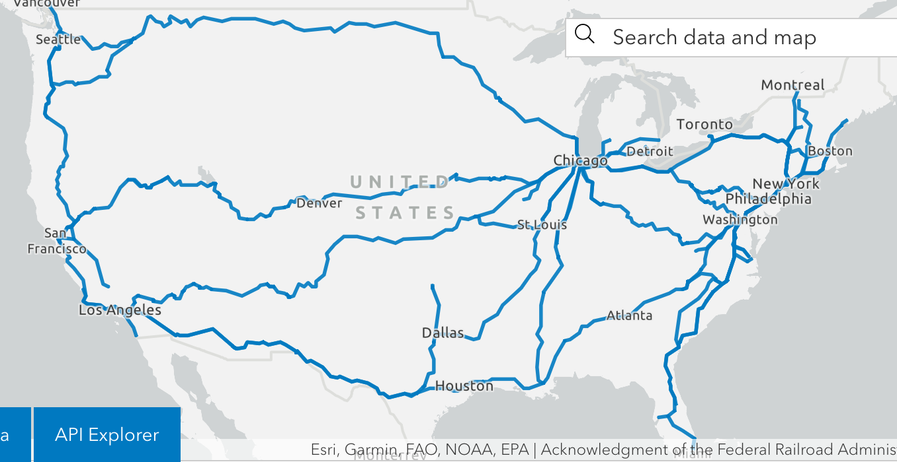

```{r setup, include=FALSE}
options(htmltools.dir.version = FALSE)
```

```{r xaringan-themer, include=FALSE}
library(xaringanthemer)
library(knitr)
library(emo)
xaringanthemer::duo_accent(
  secondary_color = "#BFCECB",
  primary_color = "#44535A",
  code_font_family = "Fira Code",
  code_font_url    = "https://cdn.rawgit.com/tonsky/FiraCode/1.204/distr/fira_code.css",
  text_font_google = google_font("Public Sans", "200"),
  header_font_google = google_font("Public Sans", "500"),
  white_color = "#fafaf7"
)
```

# The final product!

```{r echo = FALSE, fig.align = "center", out.width="150%"}
include_graphics("https://raw.githubusercontent.com/katiejolly/30-day-maps-2020/main/02-lines/amtrak_elevation.jpg")
```

---
class: inverse, center, middle

# But where to start...

---
### 30 days of maps

1. Points

2. **Lines** &larr; (we are here!)

3. Polygons

4. Hexagons...

### What are some lines I can think of quickly?

--
* Transportation routes (bus/train/ferry/etc.)

--

* Elevation

--

* Roads

--

* Origin-destination data

--

* Joyplots

---
class: inverse, center, middle

# Design time

(I chose elevation & the train route-- so many lines!)

---

# Consider your audience `r emo::ji("smile")`

1. Who is your audience?

  * I was sharing my maps on Twitter and most of my followers are also R users and have some familiarity with the geography of the US

2. How is your audience viewing your work?

  * On Twitter, which means I need to be mindful of image size and color for the best viewing experience

3. What do you want them to learn from it?

  * The biggest takeaway should be how quickly the elevation changes along the route and how different each end is 
  
---

# Find some data `r emo::ji("magnifying")`
I keep a bookmark folder of interesting datasets & articles/blog posts where I've seen them used well

.left-column[
<br>
[U.S. Geological Survey, USGS Small-scale Dataset `r emo::ji("bookmark")`](https://www.sciencebase.gov/catalog/item/581d051de4b08da350d523c3) 
<br>
<br>
<br>
<br>
<br>
<br>
[Bureau of Transportation Statistics `r emo::ji("bookmark")`](https://data-usdot.opendata.arcgis.com/datasets/amtrak-routes)

]

.right-column[
```{r echo = FALSE, out.width="50%"}
knitr::include_graphics("http://prd-tnm.s3.amazonaws.com/StagedProducts/Small-scale/thumbnails/cont48l010a_shp.png")
```


```{r echo = FALSE, out.width="50%"}

```

]

---

# Choose the colors `r emo::ji("art")`

```{r echo = FALSE, out.width="60%", fig.align="center"}
knitr::include_graphics("https://cdn.shopify.com/s/files/1/1529/3721/products/glacier-poster_1800x.jpg?v=1550751768")
```

[The Landmark Project](https://thelandmarkproject.com/products/glacier-national-park-poster)

---

# Add labels `r emo::ji("pencil")`

Annotations can:

* Guide your readers to the main point

* Provide additional context

* Reiterate important points

But... *less is more!* 


----

I chose to use a few Amtrak stations along the way to anchor the route in recognizable places.

Especially when sharing on social media, your title should be short and catchy! 

**When working on a tight timeline I like to use Illustrator/Inkscape to add labels**


---
# Share your work! `r emo::ji("camera")` `r emo::ji("tada")`

I `r emo::ji("heart")` using Twitter for this!

```{r echo = FALSE, fig.align = "center", out.width="150%"}
include_graphics("https://raw.githubusercontent.com/katiejolly/30-day-maps-2020/main/02-lines/amtrak_elevation.jpg")
```

---
class: center, middle

# See the code

[Github link](https://github.com/katiejolly/30-day-maps-2020/blob/main/02-lines/02-lines_empire_builder.R)
